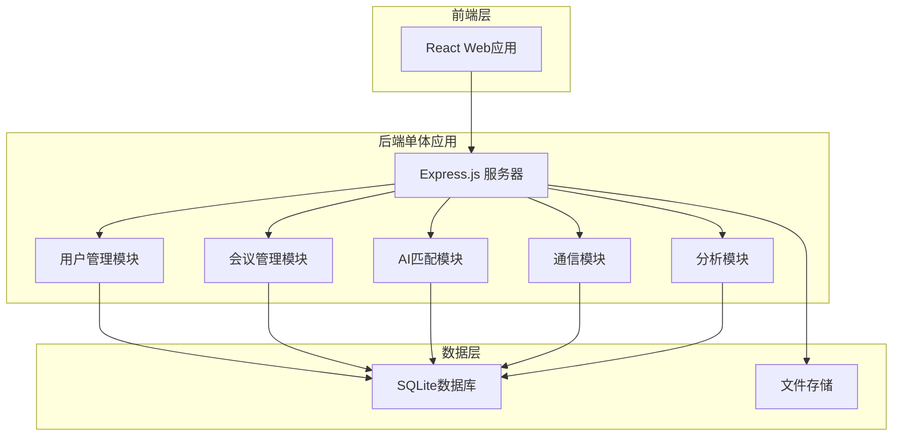

# 设计文档

## 概述

AI驱动的智能社交匹配平台是一个基于单体架构的Web应用程序，采用现代化的技术栈实现高效的用户匹配和社交互动功能。系统核心是AI匹配算法，通过多维度分析用户档案和偏好，实现精准的商业社交推荐。作为demo版本，采用简化的单体架构便于快速开发和部署。

### 核心设计原则
- **简单优先**：采用单体架构，降低复杂性，便于快速迭代
- **用户体验优先**：简洁直观的界面设计，快速响应的交互体验
- **数据驱动**：基于用户行为和反馈持续优化匹配算法
- **隐私保护**：严格的数据保护和用户隐私控制机制
- **易于部署**：单一部署包，支持快速演示和测试
- **实时性**：即时通知和实时通信功能

## 架构

### 系统架构图



### 技术栈选择

**前端技术**
- React.js + TypeScript：现代化的前端框架，提供良好的用户体验
- Material-UI：统一的设计语言和组件库
- Socket.io客户端：实时通信支持

**后端技术**
- Node.js + Express：单体应用后端框架
- TypeScript：类型安全和更好的开发体验
- Socket.io：实时双向通信
- JWT：安全的用户认证机制
- 内置AI匹配算法：使用JavaScript实现简单的匹配逻辑

**数据库**
- SQLite：轻量级数据库，适合demo和开发环境
- 文件系统：存储用户头像和其他静态资源

**部署**
- 单一部署包：前后端打包在一起
- Docker容器化：便于部署和分发

## 组件和接口

### 核心组件设计

#### 1. 用户管理组件 (UserService)

**职责**：
- 用户注册、登录、档案管理
- 用户偏好设置和隐私控制
- 用户认证和授权

**主要接口**：
```typescript
interface UserService {
  registerUser(userData: UserRegistrationData): Promise<User>
  authenticateUser(credentials: LoginCredentials): Promise<AuthToken>
  updateUserProfile(userId: string, profile: UserProfile): Promise<User>
  setMatchingPreferences(userId: string, preferences: MatchingPreferences): Promise<void>
  getUserProfile(userId: string): Promise<UserProfile>
}
```

#### 2. 会议管理组件 (EventService)

**职责**：
- 会议创建和管理
- 参与者管理
- 会议状态跟踪

**主要接口**：
```typescript
interface EventService {
  createEvent(eventData: EventCreationData): Promise<Event>
  joinEvent(userId: string, eventCode: string): Promise<void>
  getEventParticipants(eventId: string): Promise<User[]>
  updateEventStatus(eventId: string, status: EventStatus): Promise<void>
}
```

#### 3. AI匹配组件 (MatchingService)

**职责**：
- 执行匹配算法
- 生成推荐列表
- 学习用户反馈

**主要接口**：
```typescript
interface MatchingService {
  generateMatches(userId: string, eventId: string): Promise<MatchResult[]>
  applyUserPreferences(userId: string, participants: User[]): Promise<User[]>
  recordMatchingFeedback(userId: string, targetId: string, feedback: MatchingFeedback): Promise<void>
  getMatchingScore(user1: User, user2: User): Promise<number>
}
```

### AI匹配算法设计

#### 匹配算法核心逻辑

**1. 多维度评分系统**
匹配算法基于以下维度计算用户间的匹配分数：

```typescript
interface MatchingDimensions {
  industryAlignment: number      // 行业匹配度 (0-1)
  positionComplementarity: number // 职位互补性 (0-1)
  businessGoalSynergy: number    // 商业目标协同性 (0-1)
  skillsRelevance: number        // 技能相关性 (0-1)
  experienceLevel: number        // 经验水平匹配 (0-1)
  companySizeAlignment: number   // 公司规模匹配 (0-1)
  userPreferenceMatch: number    // 用户偏好匹配 (0-1)
}
```

**2. 权重配置系统**
不同维度的重要性权重可以根据会议类型和用户反馈动态调整：

```typescript
interface MatchingWeights {
  industryWeight: 0.25          // 行业权重
  positionWeight: 0.20          // 职位权重
  businessGoalWeight: 0.20      // 商业目标权重
  skillsWeight: 0.15            // 技能权重
  experienceWeight: 0.10        // 经验权重
  companySizeWeight: 0.05       // 公司规模权重
  userPreferenceWeight: 0.05    // 用户偏好权重
}
```

**3. 匹配分数计算公式**
```
总匹配分数 = Σ(维度分数 × 对应权重) × 100
```

#### 具体算法实现

**行业匹配度计算**：
- 完全匹配：1.0分
- 相关行业：0.7分（如科技与金融科技）
- 互补行业：0.5分（如制造业与供应链）
- 无关行业：0.1分

**职位互补性计算**：
- 上下游关系：1.0分（如CEO与投资人）
- 同级别不同领域：0.8分（如CTO与CMO）
- 同职位不同行业：0.6分
- 其他情况：0.3分

**商业目标协同性**：
- 目标完全匹配：1.0分
- 目标部分重叠：0.7分
- 目标互补：0.5分
- 目标无关：0.2分

**用户偏好匹配**：
- 完全符合用户设定的匹配条件：1.0分
- 部分符合：按符合比例计分
- 不符合：0.1分

#### 算法优化机制

**1. 反馈学习系统**
```typescript
interface FeedbackLearning {
  positiveConnections: number[]  // 成功连接的用户ID
  negativeConnections: number[]  // 拒绝连接的用户ID
  meetingOutcomes: MeetingOutcome[] // 会面结果反馈
}
```

**2. 动态权重调整**
- 根据用户的连接成功率调整各维度权重
- 基于会议类型优化权重配置
- 考虑用户活跃度和参与度

**3. 冷启动问题解决**
- 新用户：基于档案信息使用默认权重
- 数据不足：增加随机性，鼓励多样化匹配
- 逐步学习：随着交互增加，个性化程度提高

#### 匹配结果排序和过滤

**排序策略**：
1. 按匹配分数降序排列
2. 考虑用户在线状态（在线用户优先）
3. 避免重复推荐（已连接或已拒绝的用户）
4. 引入随机因子，避免结果过于固化

**过滤机制**：
- 隐私设置过滤：尊重用户的可见性设置
- 黑名单过滤：排除被用户屏蔽的人
- 活跃度过滤：优先推荐活跃用户
- 多样性保证：确保推荐结果的多样性

#### 4. 通信组件 (CommunicationService)

**职责**：
- 实时消息传递
- 连接请求管理
- 会面安排

**主要接口**：
```typescript
interface CommunicationService {
  sendConnectionRequest(fromUserId: string, toUserId: string): Promise<void>
  acceptConnectionRequest(requestId: string): Promise<void>
  sendMessage(fromUserId: string, toUserId: string, message: string): Promise<void>
  scheduleMeeting(participants: string[], meetingDetails: MeetingDetails): Promise<Meeting>
}
```

## 数据模型

### 核心数据结构

#### 用户模型 (User)
```typescript
interface User {
  id: string
  email: string
  name: string
  company: string
  position: string
  industry: string
  bio: string
  skills: string[]
  interests: string[]
  businessGoals: string[]
  avatar?: string
  linkedinProfile?: string
  createdAt: Date
  updatedAt: Date
}
```

#### 匹配偏好模型 (MatchingPreferences)
```typescript
interface MatchingPreferences {
  targetPositions: string[]
  targetIndustries: string[]
  companySizePreference: CompanySize[]
  experienceLevelPreference: ExperienceLevel[]
  businessGoalAlignment: string[]
  geographicPreference?: string[]
}
```

#### 会议模型 (Event)
```typescript
interface Event {
  id: string
  name: string
  description: string
  startDate: Date
  endDate: Date
  location: string
  organizerId: string
  eventCode: string
  maxParticipants?: number
  status: EventStatus
  participants: string[]
  createdAt: Date
}
```

#### 匹配结果模型 (MatchResult)
```typescript
interface MatchResult {
  targetUser: User
  matchScore: number
  matchReasons: MatchReason[]
  commonInterests: string[]
  businessSynergies: string[]
  recommendationStrength: 'HIGH' | 'MEDIUM' | 'LOW'
}
```

### 数据库设计

**SQLite数据库表结构**
- **users表**：基本用户信息和档案
- **matching_preferences表**：用户匹配偏好设置
- **events表**：会议基本信息
- **event_participants表**：会议参与者关系
- **matches表**：匹配结果和历史记录
- **connections表**：用户连接请求和状态
- **messages表**：用户间消息记录
- **feedback表**：匹配反馈数据

**表关系设计**
- 用户与匹配偏好：一对一关系
- 会议与参与者：多对多关系
- 用户与匹配结果：一对多关系
- 用户与连接：多对多关系
- 用户与消息：一对多关系（发送者角度）

## 错误处理

### 错误分类和处理策略

#### 1. 用户输入错误
- **验证错误**：前端实时验证 + 后端二次验证
- **格式错误**：统一的错误消息格式和用户友好提示
- **权限错误**：清晰的权限提示和引导

#### 2. 系统错误
- **数据库连接错误**：自动重试机制 + 降级服务
- **AI服务错误**：回退到基础匹配算法
- **第三方服务错误**：优雅降级和用户通知

#### 3. 业务逻辑错误
- **匹配失败**：提供替代推荐和建议
- **通信失败**：重试机制和离线消息支持
- **并发冲突**：乐观锁和冲突解决策略

### 错误响应格式
```typescript
interface ErrorResponse {
  error: {
    code: string
    message: string
    details?: any
    timestamp: Date
    requestId: string
  }
}
```

## 测试策略

### 测试层次

#### 1. 单元测试
- **覆盖率目标**：80%以上
- **重点测试**：匹配算法、数据验证、业务逻辑
- **工具**：Jest + Testing Library

#### 2. 集成测试
- **API测试**：所有REST端点和WebSocket连接
- **数据库测试**：数据一致性和事务处理
- **工具**：Supertest + Test Containers

#### 3. 端到端测试
- **用户流程测试**：注册、匹配、通信完整流程
- **性能测试**：高并发场景和响应时间
- **工具**：Playwright + K6

#### 4. AI算法测试
- **匹配质量测试**：A/B测试和用户反馈分析
- **算法公平性测试**：避免偏见和歧视
- **性能基准测试**：匹配速度和准确性指标

### 测试数据管理
- **测试数据生成**：自动化的测试用户和会议数据生成
- **数据隔离**：测试环境完全独立的数据库
- **数据清理**：测试后自动清理和重置

### 持续集成
- **自动化测试**：每次代码提交触发完整测试套件
- **质量门禁**：测试通过率和代码覆盖率要求
- **部署流水线**：测试通过后自动部署到预发布环境